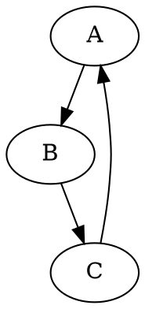

# Notas precenciales

Los atributos static le pertenecen a la clase.
Al crear un objeto tengo acceso a los atributos static (comunes para todas las instancias).

El SO es el encargado de gestionar los procesos, asignando los recursos disponibles (gestiona monitores, barreras, etc...)

## Sincronizacion

Si no se comparten datos no hay problemas de sincronización!

Que se compartan datos no implica problemas de sincronización

- Exclusion mutua

2 procesos no se pueden ejecutar al tiempo

cada objeto se vuelve un monitor, el objeto debe estar declarado como static

Cuando uso sychornized en un metodo el metodo sera una seccion critica

- Señalamiento

Un proceso despues del otro

Si hay lectores los redactores deben esperar, si hay redactores todos deben esperar.

- Encuentro

Un programa espera a que se cumpla una condicion de otro programa para ejecutarse

Productor consumidor.

Un thread genera datos el otro los recibe.

Entre el productor y e conusmidor hay un buffer. El buffer se usa para almacenar temporalmente datos cuando el cnosumidor no lo puede procesar.

desacoplar: cada proceso puede realizar su proceso a su ritmo.

## Implementación

Un proceso para su ejecución necesita un thread, el proceso es el contexto del thread

Cada flujo tiene su propia pila

2 procesoso no comparten absolutamente nada, los threads que esten dentro del mismo proceso si pueden compartir, no comparten los registros

El SO se encarga de gestionar los recursos (procesador ram, archivos, comunicación)

Un driver sera parte del sistema operativo,

### Context switch

Se cambia la ejecucion del thread, el procesador no deberia estar sin usar.

### Scheduling

Se encarga de asignar que proceso es el siguiente proceso a ejecutar, es un proceso deterministico

### Interrupciones

Cuando un dispositivo requiere del procesador tiene que interrumpir el proceso en ejecución. Las instruccions son de hardware

### Multiprocesador

AL tener una maquina con multiprocesadores se tiene el mismo modelo, solo que se despachan mas rapido lso procesos dado que hay mas campos de ejecución

### Colas de despacho

cola de listos:

cola de disco:

cola de tiempo

PCB process control block:

Quantum pequeño -> mucho cambio

Quatum grande -> poca responsivenes a la hora de ejecutar un programa

Los procesos ocupan memoria, los threads estan dentro de los procesos y la memoria es usada con 

